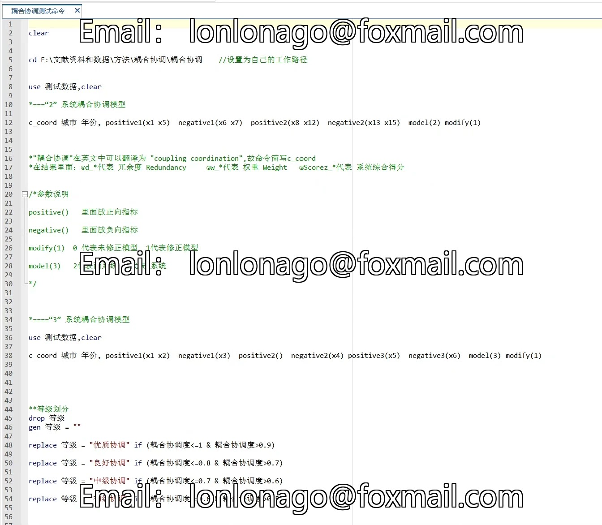
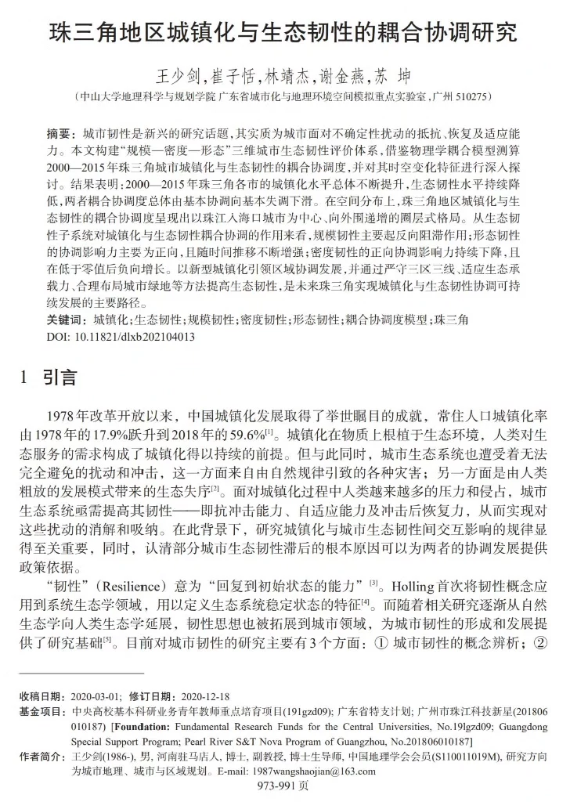

## Body

Coupling Coordination Degree, Modified Coupling Coordination Degree Model

Stata command can be run based on the specific number of systems to choose the command, and changing variable names directly calculates.
Includes example test data dta file, code doc, references.
Automatic shipping! Purchase and ship immediately upon completion!
Virtual goods sold after purchase are not refundable or exchangeable. Please read descriptions carefully before purchasing!
Need Q&A? Purchase the Q&A product, data is not responsible for Q&A!

## Images

item_1062560054972

Here is a pay link on Stripe ( https://buy.stripe.com/3cs8yP7sY87d0vu9AB ). Please contact me lonlonago@foxmail.com after funding $89, and I will send you a complete data files , thank you!

